# 🍽️ Food Hero

Food Hero is a modern web application designed to combat food waste by enabling users to track their food orders and portions from previous restaurant visits. By recording and analyzing eating habits, users can make smarter ordering decisions, avoid excessive portions, and reduce personal food waste. The app features location tracking, meal history, portion satisfaction ratings, and social sharing functionality through user groups.

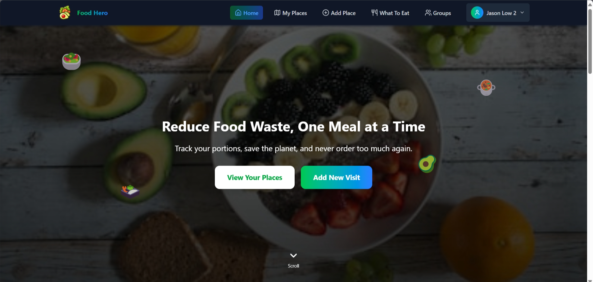


## Features

- 🔐 User authentication and profiles
- 📝 Track orders from past visits
- 🍔 Food listing management
- 🔍 Search and filter past food items
- 📍 Location-based matching
- 🤔 What To Eat
- 🔄 Sharing between users
- 👥 Groups

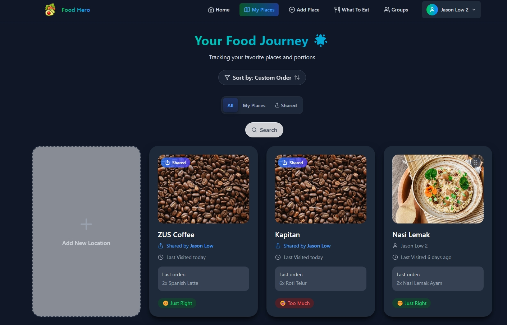

## Tech Stack

- React 18
- TypeScript
- Vite
- ESLint for code quality
- Tailwind CSS for styling
- Firebase for backend services

## App Screenshots

### Adding Restaurant

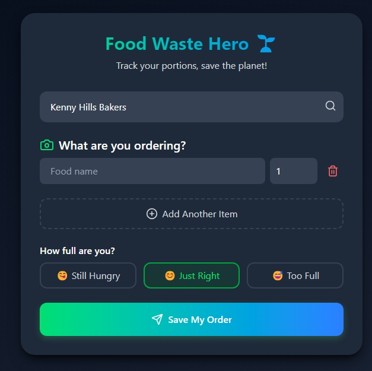
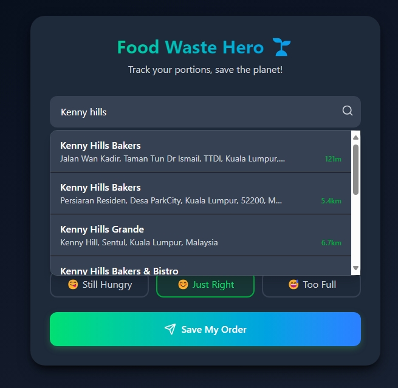

### Food Location Details

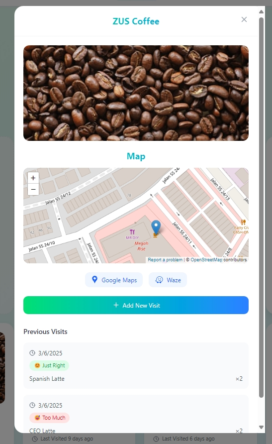

### Group Sharing

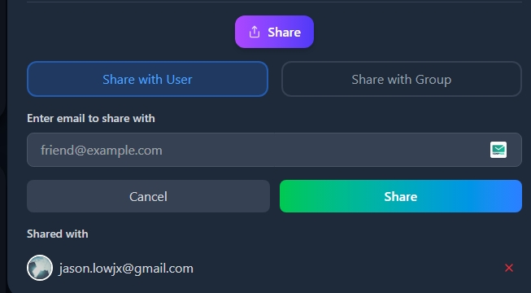
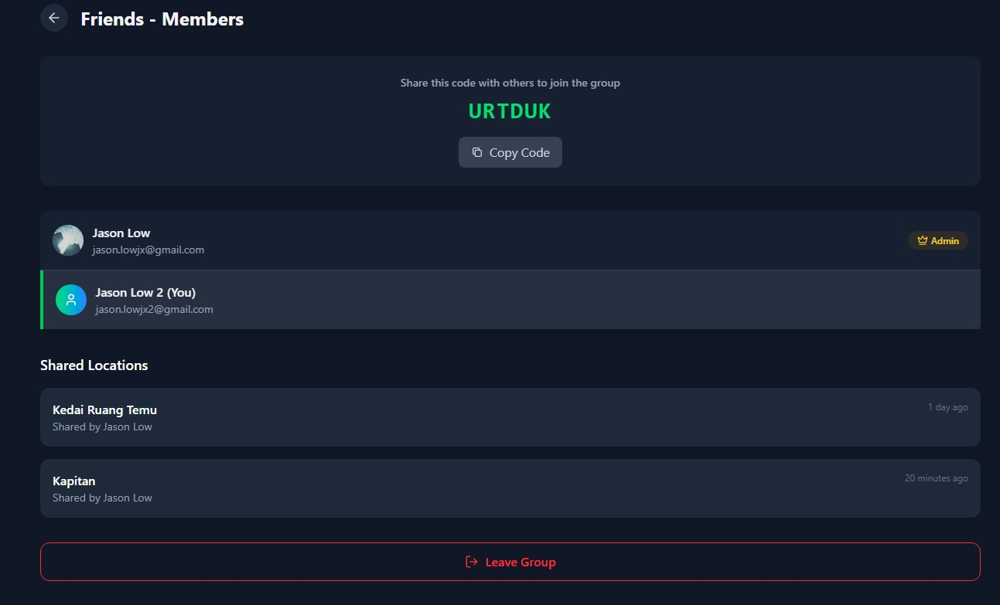

### What To Eat

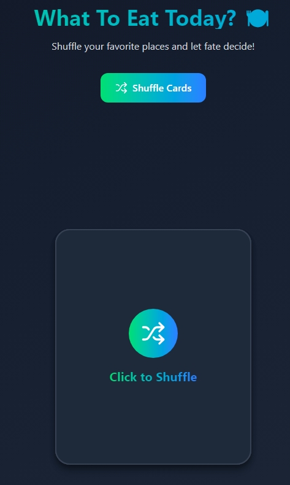
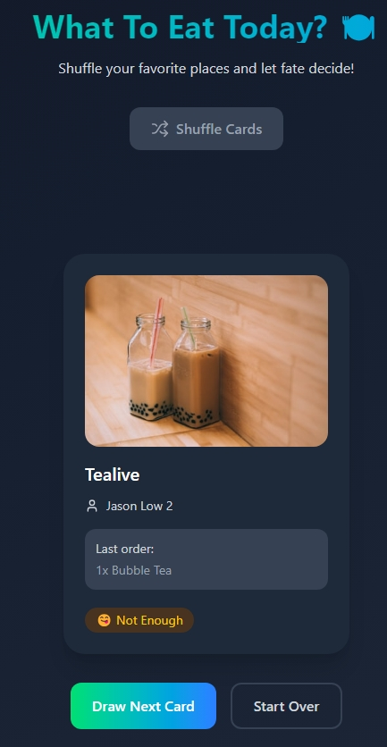

### Dark & Light Modes

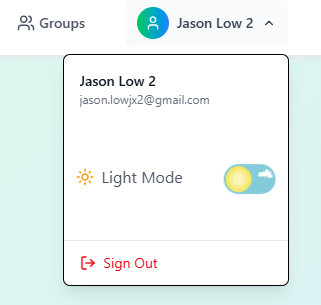

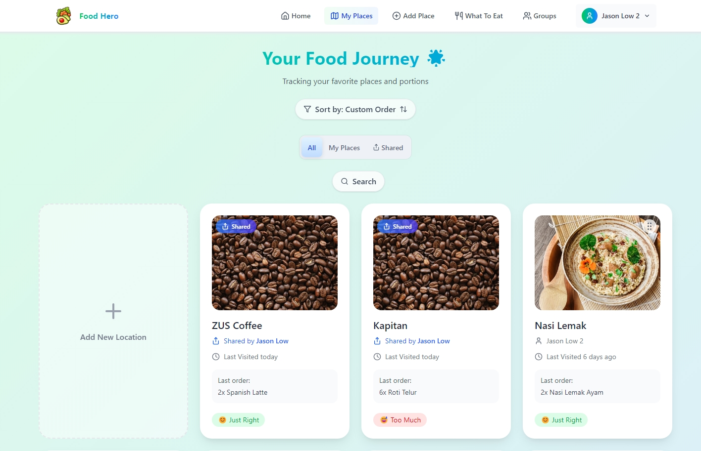

## Getting Started

### Prerequisites

- Node.js (v16+)
- npm or yarn

### Environment Configuration

1. Create a `.env` file in the root directory of your project:

```bash
touch .env
```

2. Add your Firebase configuration to the .env file:

```bash
VITE_FIREBASE_API_KEY=your_api_key
VITE_FIREBASE_AUTH_DOMAIN=your_auth_domain
VITE_FIREBASE_PROJECT_ID=your_project_id
VITE_FIREBASE_STORAGE_BUCKET=your_storage_bucket
VITE_FIREBASE_MESSAGING_SENDER_ID=your_messaging_sender_id
VITE_FIREBASE_APP_ID=your_app_id
```

3. Get these values from your Firebase console:

4. Go to Firebase Console

- Select your project
- Click on the gear icon (⚙️) near "Project Overview"
- Select "Project settings"
- Scroll down to "Your apps" section
- Copy the configuration values

### Installation

1. Clone the repository

```bash
git clone https://github.com/yourusername/food-hero.git
cd food-hero
```

2. Install dependencies

```bash
npm install
# or
yarn
```

3. Start the development server

```bash
npm run dev
# or
yarn dev
```

4. Open your browser at `http://localhost:5173`

## Building for Production

```bash
npm run build
# or
yarn build
```

## Contributing

Contributions are welcome! Please feel free to submit a Pull Request.

## License

This project is licensed under the MIT License - see the LICENSE file for details.
