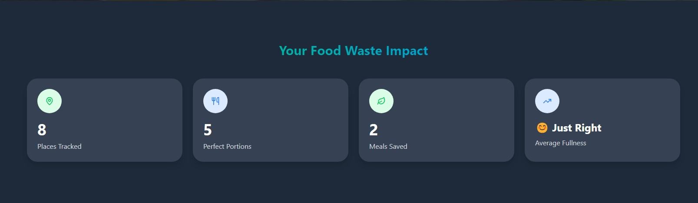

# Food Hero

Food Hero is a React application built with TypeScript and Vite that helps reduce food waste by allowing users to record their orders from their previous visits to prevent ordering excessively.




## Features

- User authentication and profiles
- Track orders from past visits
- Food listing management
- Search and filter past food items
- Location-based matching
- What To Eat
- Sharing between users
- Groups


## Tech Stack

- React 18
- TypeScript
- Vite
- ESLint for code quality
- Tailwind CSS for styling
- Firebase for backend services

## App Screenshots

### Adding Restaurant


### Food Location Details


### Group Sharing


### What To Eat


### Dark & Light Modes


## Getting Started

### Prerequisites

- Node.js (v16+)
- npm or yarn

### Installation

1. Clone the repository

```bash
git clone https://github.com/yourusername/food-hero.git
cd food-hero
```

2. Install dependencies

```bash
npm install
# or
yarn
```

3. Start the development server

```bash
npm run dev
# or
yarn dev
```

4. Open your browser at `http://localhost:5173`

## Building for Production

```bash
npm run build
# or
yarn build
```

## Contributing

Contributions are welcome! Please feel free to submit a Pull Request.

## License

This project is licensed under the MIT License - see the LICENSE file for details.
